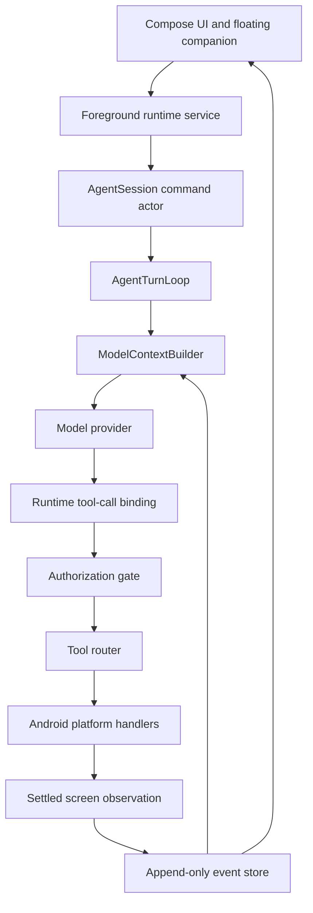

# Ferro

Uses nim api key for llm service( available for free), needs to be adopted for provider agnostic.

Ferro is an Android agent app and agent harness written in Kotlin.

I built it to understand what makes an agent reliable beyond the basic loop of sending a prompt to
a model and executing a tool call. Ferro takes a task, observes the phone, asks a multimodal model
what to do next, executes typed Android actions, observes the result, and continues until the task is
complete or the user needs to step in.

The Android app is useful on its own, but the main focus of this project is the engineering around the
agent: context construction, tool protocols, execution authority, approvals, interruption, recovery,
and debugging.

## What it can do

Ferro currently runs against real model providers and a real Android device. It can:

- capture the current screen and send it to a vision-capable model;
- tap, swipe, type into a focused field, use Android navigation, and launch installed apps;
- inspect Android facts such as the foreground package, active window, keyboard, and keyguard state;
- pause, resume, stop, or steer a task while it is running;
- ask the user for information or hand control of the phone back to them;
- show the active task and current action in a floating companion window;
- require approval for sensitive actions, or run in an explicitly selected autonomous mode;
- recover safely after process death without replaying an action whose outcome is uncertain;
- keep an inspectable timeline of model reasoning, messages, screenshots, tool calls, and results.

## The agent loop

The model is the planner, but it is not the authority over the phone. The Kotlin runtime owns the
loop and decides whether a proposed action is valid and allowed.

```text
user task
  -> build context from durable events
  -> call the model
  -> record reasoning, text, and typed tool calls
  -> bind the call to current Android state
  -> validate scope, risk, approval, and arguments
  -> execute one serialized Android action
  -> capture a settled post-action screenshot
  -> record the paired tool result
  -> continue or complete the task
```

Every task has explicit model-iteration, tool-call, action, and repeated-failure limits. Completion is
also explicit: the model must call `complete_task`. A normal assistant message does not silently mark
a task as completed.

## Architecture



The project is split into modules so that provider JSON, Android APIs, UI state, and core agent logic
do not become one large runtime:

```text
contracts/         Serialized events, operations, model types, and tool types
core/              Agent loop, context, event interfaces, policy, approvals, and control
platform-android/  Screenshots, Android actions, window state, settlement, and artifacts
runtime-android/   Foreground service, process recovery, notification, and overlay
provider-*/        HTTP, SSE, and provider-specific protocol translation
app/               Compose UI and dependency assembly
```

## Durable state

Ferro records the important parts of a task as append-only typed events. This includes turns, model
iterations, user input, assistant messages, tool calls, results, approvals, recovery, and terminal
outcomes.

The live model context and the Compose UI are rebuilt as projections of that history. They are not
separate sources of truth. This makes failures easier to inspect and makes process recovery possible
without guessing what happened before the app stopped.

## Tool execution

The model only sees generic tools such as `observe_screen`, `tap`, `swipe`, `type_text`, `key_action`,
`open_app`, and `wait`. App-specific workflows are not hard-coded into the harness.

Screenshot-dependent calls are bound to observation authority by the runtime. The model does not
create or control internal observation IDs. Before native dispatch, Ferro checks the exact call,
arguments, task capability scope, current Android window, risk decision, and any required approval.

After an action, Ferro waits for accessibility-event quietness and package stability before taking the
next screenshot. A successful Android dispatch only means the platform accepted the operation. The
model still has to inspect the returned screen and decide whether the intended result happened.

## User control and safety

All UI surfaces submit operations to one session-owned command actor. The Activity, notification, and
floating companion cannot accidentally start separate agent loops.

Pause and steering happen at explicit checkpoints around model and tool work. Approvals are owned by
the runtime rather than requested or granted by the model. An approval is bound to one thread, turn,
tool call, argument hash, observation, package, capability scope, risk level, and expiry time.

Ferro also has an Autonomous profile for development and testing. It removes Ferro's package and
approval restrictions for the advertised tools, but it cannot bypass Android accessibility,
protected authentication screens, overlay permission, or other operating-system security.


## Testing

The test suite covers protocol serialization, event reconstruction, tool-call/result pairing, session
concurrency, pause and interruption, approval expiry, capability denial, process recovery, provider
streaming, Android UI settlement, and runtime observation binding.

I also test the complete loop with real provider requests and an attached Android phone.

Routine verification can be run with:

```bash
./gradlew -q test lintDebug assembleDebug
```

## Running the app

Requirements:

- Android Studio with JDK 17;
- an Android 11 or newer device for accessibility screenshot capture;
- Android accessibility permission for device control;
- overlay permission for the floating companion;
- a compatible model endpoint, model name, and API credential.

Build and install the debug APK:

```bash
./gradlew -q assembleDebug
adb install -r app/build/outputs/apk/debug/app-debug.apk
```

After installation, enable **Ferro device control** in Android Accessibility settings. Reinstalling a
debug APK can disable this service on some Android devices.

## Current limitations

Ferro is a working MVP, but I do not consider the harness finished. The main engineering work still
in progress is:

- token-aware context budgeting and real context compaction;
- plan and task feature
- stronger detection of meaningful visual changes inside the same Android window;
- complete runtime validation of every advertised JSON tool schema;
- action accounting based on confirmed dispatch rather than proposed calls;
- bounded retention for events and screenshot artifacts;
- provider retry policy and a total wall-time budget for a turn;
- settled acknowledgements for commands submitted to the session actor;
- a larger automated and physical-device regression suite.

Secure or protected Android surfaces may return a black screenshot. Ferro treats that as incomplete
evidence and can ask the user to take control, but it does not attempt to bypass the protected surface.

